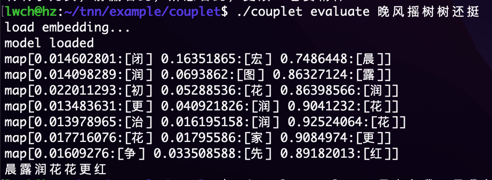

# 对对联

该示例使用GPT模型来进行自动对对联，训练过程中使用开源数据集[couplet-dataset](https://github.com/wb14123/couplet-dataset)进行训练，最终效果如下





模型结构如下，共计44万参数


## 编译

调整`logic/model/params.go`中的参数后使用以下命令进行编译

```shell
go build
```

## 模型训练

```shell
# 下载数据集
./couplet download
# 对数据集进行裁剪，提高训练速度
./couplet cut 1000
# 模型训练
./couplet train
```

## 模型推理

```shell
./couplet evaluate 丹枫江冷人初去

结果如下:
map[0.01633992:[宏] 0.018458867:[兴] 0.88452774:[绿]]
map[0.016707825:[图] 0.022102214:[起] 0.9094538:[柳]]
map[0.02144422:[新] 0.029528476:[高] 0.8999109:[堤]]
map[0.023929289:[燕] 0.025604168:[复] 0.89014614:[新]]
map[0.015875278:[治] 0.02589199:[新] 0.87022376:[燕]]
map[0.013464654:[家] 0.024450727:[新] 0.91466177:[复]]
map[0.017396515:[燕] 0.025753658:[复] 0.8819935:[来]]
绿柳堤新燕复来
```

由于GPT模型是一个字一个字进行推理的，因此输出内容中的每一行表示该位置上的输出字概率