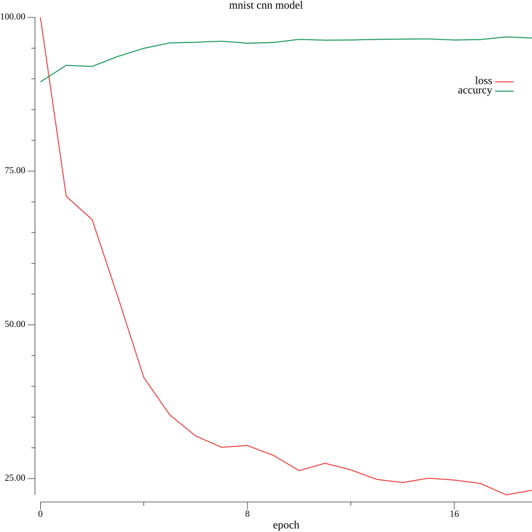
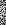
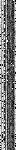

# mnist

手写数字识别示例，该示例使用CNN([LeNet](https://en.wikipedia.org/wiki/LeNet))模型进行分类

## 编译

```shell
go build
```

## 模型训练

可通过以下命令进行模型训练

```shell
./mnist
```

首次运行时会下载mnist数据到data目录，然后进行20个epoch的训练，训练结果如下：

```
loading train data...
loading test data...
Epoch: 0, Cost: 1m18.191825665s, Loss: 0.12834, Accuracy: 89.51%
Epoch: 1, Cost: 1m17.632531045s, Loss: 0.09098, Accuracy: 92.21%
Epoch: 2, Cost: 1m18.12648571s, Loss: 0.08614, Accuracy: 92.03%
Epoch: 3, Cost: 1m18.255555835s, Loss: 0.06990, Accuracy: 93.66%
Epoch: 4, Cost: 1m18.346457479s, Loss: 0.05314, Accuracy: 94.97%
Epoch: 5, Cost: 1m18.772343938s, Loss: 0.04537, Accuracy: 95.85%
Epoch: 6, Cost: 1m18.810644715s, Loss: 0.04098, Accuracy: 95.95%
Epoch: 7, Cost: 1m19.035261163s, Loss: 0.03862, Accuracy: 96.13%
Epoch: 8, Cost: 1m18.903308783s, Loss: 0.03899, Accuracy: 95.80%
Epoch: 9, Cost: 1m18.527616824s, Loss: 0.03694, Accuracy: 95.92%
Epoch: 10, Cost: 1m18.849698456s, Loss: 0.03374, Accuracy: 96.42%
Epoch: 11, Cost: 1m19.70375939s, Loss: 0.03528, Accuracy: 96.29%
Epoch: 12, Cost: 1m19.406772576s, Loss: 0.03390, Accuracy: 96.32%
Epoch: 13, Cost: 1m19.335218045s, Loss: 0.03191, Accuracy: 96.42%
Epoch: 14, Cost: 1m19.278367259s, Loss: 0.03126, Accuracy: 96.47%
Epoch: 15, Cost: 1m19.439969049s, Loss: 0.03217, Accuracy: 96.50%
Epoch: 16, Cost: 1m19.899889213s, Loss: 0.03178, Accuracy: 96.32%
Epoch: 17, Cost: 1m19.346928771s, Loss: 0.03108, Accuracy: 96.39%
Epoch: 18, Cost: 1m19.141365277s, Loss: 0.02869, Accuracy: 96.82%
Epoch: 19, Cost: 1m19.053522015s, Loss: 0.02965, Accuracy: 96.64%
train cost: 31m14.68101318s, param count: 44426
```

loss和accuracy用图像表示如下：



模型的最终结果将被保存至model目录下，每一个文件代表每一次epoch的训练结果

## 模型预测

可通过以下命令进行识别：

```shell
./mnist -predict ./data/test/<n>.png
```

识别结果如下：

```
Predict:
0: 0.02608
1: 0.98530
2: -0.00158
3: -0.02494
4: -0.02135
5: 0.00632
6: -0.01133
7: -0.01560
8: 0.05620
9: -0.00056
Result: 1
```

## 特征可视化

可通过以下命令将卷积层的特征矩阵转换成图片：

```shell
./mnist -export-conv
```

图片给将被保存到conv目录下，最终显示效果如下：



