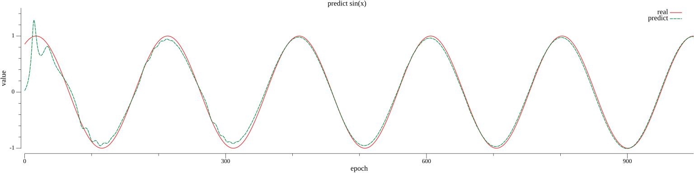

# sin

该示例演示了如何使用tnn库来构造RNN和LSTM模型，模型主要由：RNN/LSTM层、Flatten层、Output层构成，参数定义如下：

```go
const lr = 1e-3
const epoch = 1000
const batchSize = 32
const steps = 8
const featureSize = 16
const hiddenSize = 64
```

下面是模型训练后拟合出的图像：

rnn



lstm

