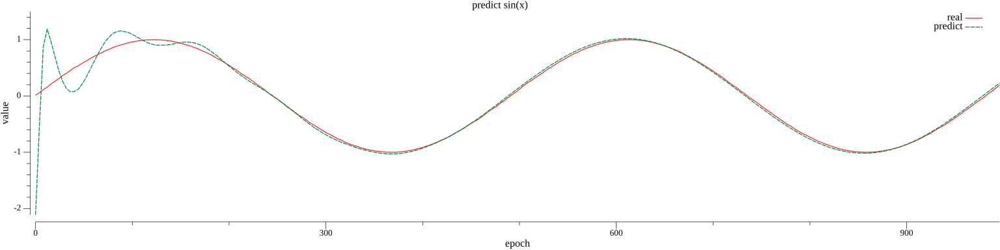

# sin_attention

该示例演示了如何使用tnn库来构造RNN和LSTM模型，模型主要由：2个Transformer模块、Flatten层、Sigmoid层、Output层构成，参数定义如下：

```go
const lr = 1e-3
const epoch = 1000
const batchSize = 128
const steps = 32
const dims = 8
const transformerSize = 2
```

下面是模型训练后拟合出的图像：


